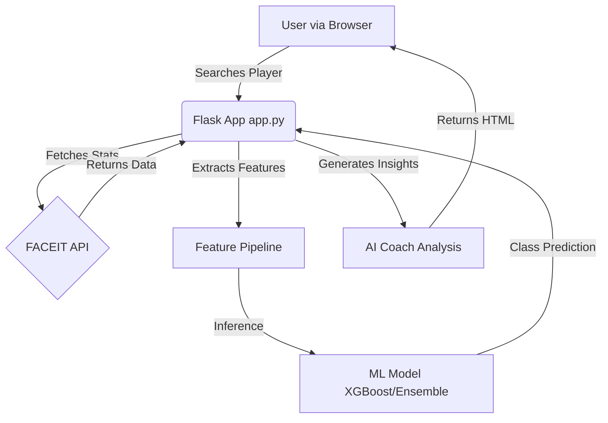

# 🎮 Fasik: CS2 Player Classifier


**Fasik** is an AI-powered machine learning system that analyzes Counter-Strike 2 players on FACEIT. It classifies players into three skill categories (**PRO**, **HIGH-LEVEL**, **NORMAL**) and provides personalized performance analysis, stat comparisons, and AI-driven improvement recommendations.

---

## 🎥 Video Demonstration

Check out this demonstration of Fasik analyzing a professional player ("ZywOo") followed by a normal player ("Qydnama"):

<video src="https://github.com/ansinitro/fasik/raw/main/assets/demo.mp4" width="100%" controls autoplay loop muted></video>

---

## 🎯 Overview

This project demonstrates a complete end-to-end machine learning pipeline:

1.  **Data Collection**: Fetches real-time player stats via the FACEIT API.
2.  **Feature Engineering**: Extracts 30+ statistical features (K/D, Headshot %, Win Streaks, etc.).
3.  **Model Training**: Uses an **Ensemble Voting Classifier** (XGBoost + Random Forest + Logistic Regression) for high accuracy.
4.  **Deployment**: Flask web application with an interactive UI for real-time predictions.

### Classification Categories

*   🏆 **PRO**: Professional players from competitive teams (HLTV database).
*   🔥 **HIGH-LEVEL**: Elite players (FACEIT Level 10, high ELO).
*   😐 **NORMAL**: Standard players (FACEIT Level 6-7).

---

## ✨ Features

*   ✅ **Real-time Classification**: Instantly predicts if a player is performing at a Pro, High, or Normal level.
*   ✅ **Deep Stat Analysis**: Breaks down K/D, Headshot %, Win Rate, and more.
*   ✅ **Smart Feedback**: Identifies strengths and weaknesses based on ML patterns.
*   ✅ **Live Search**: Look up any FACEIT player by nickname with autocomplete.

---

## 🏗️ System Architecture



---

## 🚀 Installation

### Prerequisites

*   Python 3.8 or higher
*   FACEIT API Key (Get one free at [developers.faceit.com](https://developers.faceit.com/))

### Setup Steps

1.  **Clone the repository**
    ```bash
    git clone https://github.com/ansinitro/fasik.git
    cd fasik
    ```

2.  **Create and activate virtual environment**
    ```bash
    python -m venv .venv
    source .venv/bin/activate  # On Windows: .venv\Scripts\activate
    ```

3.  **Install dependencies**
    ```bash
    pip install -r requirements.txt
    ```

4.  **Configure API Key**
    Create a `.env` file in the root directory and add your key:
    ```env
    FACEIT_API_KEY=your_api_key_here
    ```

5.  **Run the Application**
    ```bash
    python src/web/app.py
    ```
    Access the app at `http://localhost:5000`

---

## 📁 Project Structure

```
fasik/
│
├── data/                          # Datasets and processed files
├── models/                        # Trained ML models (pkl files)
├── results/                       # Training metrics and comparisons
├── src/
│   ├── data_collection/           # Scripts to scrape HLTV & FACEIT API
│   ├── preprocessing/             # Feature engineering & cleaning
│   ├── training/                  # Model training pipelines
│   └── web/                       # Flask application
│       ├── static/                # CSS, JS, Images
│       ├── templates/             # HTML templates
│       └── app.py                 # Main application entry point
│
├── config.py                      # Configuration settings
├── requirements.txt               # Python dependencies
└── README.md                      # Project documentation
```

## 📈 Model Performance

The system uses an **Ensemble Voting Classifier** combining the strengths of multiple models:

| Model | Accuracy | Role |
|-------|----------|------|
| **XGBoost** | ~88.7% | Primary classifier (Gradient Boosting) |
| **Ensemble Voting** | ~88.7% | Best overall performance |
| **Random Forest** | ~88.1% | Robustness & Feature Importance |
| **Logistic Regression** | ~87.4% | Baseline calibration |

**Top Features used for prediction:**
1.  `faceit_elo`
2.  `kd_ratio`
3.  `win_rate`
4.  `avg_headshots`
5.  `win_contribution` (Derived metric)

---

## 🤝 Contributing

Contributions are welcome! Feel free to open issues or submit pull requests.

1.  Fork the repo
2.  Create your feature branch (`git checkout -b feature/NewFeature`)
3.  Commit your changes (`git commit -m 'Add NewFeature'`)
4.  Push to the branch (`git push origin feature/NewFeature`)
5.  Open a Pull Request

---

## 📝 License

This project is licensed under the MIT License.

---

**Built with ❤️ for the CS2 community.**